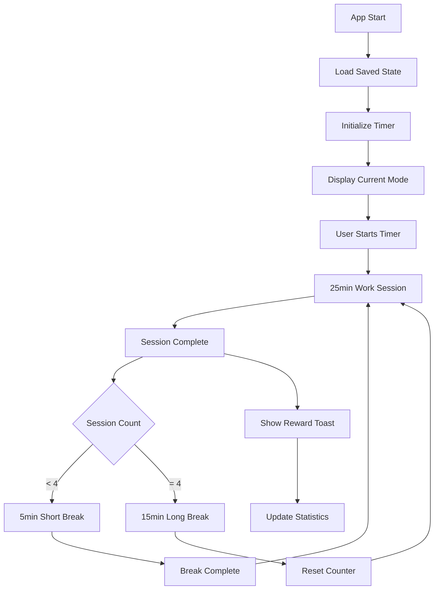

# Design Document

## Overview

The Pomodoro Timer application will be built as a single-page application using vanilla JavaScript, HTML, and CSS. It will extend the existing RFocus Pro application with comprehensive Pomodoro functionality, automatic session management, reward animations, and task/goal tracking. The design emphasizes user experience with smooth animations, visual feedback, and intuitive navigation.

## Architecture

### Core Components

1. **Timer Engine** - Manages Pomodoro cycles, session counting, and automatic transitions
2. **UI Controller** - Handles DOM updates, animations, and user interactions
3. **Task Manager** - Manages task creation, editing, completion, and Pomodoro associations
4. **Goal Tracker** - Tracks daily/weekly goals and progress visualization
5. **Notification System** - Handles toast messages, animations, and audio feedback
6. **Statistics Engine** - Records and analyzes productivity data
7. **Storage Manager** - Handles local storage for persistence

### Application Flow



## Components and Interfaces

### Timer Engine (`TimerEngine`)

**Responsibilities:**

- Manage countdown timers for work/break sessions
- Track session counts and automatically transition between modes
- Handle pause/resume/reset functionality
- Emit events for UI updates and notifications

**Key Methods:**

```javascript
class TimerEngine {
  start()                    // Start/resume timer
  pause()                    // Pause current timer
  reset()                    // Reset to initial state
  skip()                     // Skip current session
  extend(minutes)            // Extend current session
  getCurrentState()          // Get current timer state
  getSessionInfo()           // Get session count and type info
}
```

**Events Emitted:**

- `tick` - Every second with remaining time
- `sessionComplete` - When work session ends
- `breakComplete` - When break ends
- `cycleComplete` - When full 4-session cycle ends

### Notification System (`NotificationManager`)

**Responsibilities:**

- Display animated toast messages for session completions
- Play audio notifications
- Show reward animations with increasing intensity
- Handle browser notification permissions

**Toast Types:**

- Work session complete (gift box animation)
- Break complete (encouraging message)
- Cycle complete (celebration animation)
- Task completion (achievement badge)
- Goal achievement (special effects)

**Animation Patterns:**

```css
.toast-enter {
  transform: translateY(-100px) scale(0.8);
  opacity: 0;
}
.toast-active {
  transform: translateY(0) scale(1);
  opacity: 1;
}
.gift-animation {
  animation: giftBounce 0.6s ease-out;
}
```

### Task Manager (`TaskManager`)

**Responsibilities:**

- CRUD operations for tasks
- Associate Pomodoros with specific tasks
- Track task completion and estimated vs actual time
- Manage task priorities and categories

**Data Structure:**

```javascript
class Task {
  constructor(id, title, description, estimatedPomodoros, category, priority) {
    this.id = id;
    this.title = title;
    this.description = description;
    this.estimatedPomodoros = estimatedPomodoros;
    this.completedPomodoros = 0;
    this.category = category;
    this.priority = priority; // high, medium, low
    this.completed = false;
    this.createdAt = new Date();
    this.completedAt = null;
  }
}
```

### Goal Tracker (`GoalTracker`)

**Responsibilities:**

- Set and track daily/weekly/monthly goals
- Calculate completion percentages
- Provide progress visualizations
- Send motivational notifications

**Goal Types:**

- Daily Pomodoro count target
- Weekly task completion target
- Focus time goals
- Streak maintenance goals

### Statistics Engine (`StatisticsEngine`)

**Responsibilities:**

- Record all completed sessions with timestamps
- Calculate productivity metrics and patterns
- Generate reports and visualizations
- Identify peak productivity hours

**Metrics Tracked:**

- Sessions completed per day/week/month
- Average session completion rate
- Peak productivity hours
- Task completion efficiency
- Break adherence rate

## Data Models

### Session Record

```javascript
{
  id: string,
  type: 'work' | 'shortBreak' | 'longBreak',
  startTime: Date,
  endTime: Date,
  completed: boolean,
  taskId: string | null,
  interrupted: boolean
}
```

### User Preferences

```javascript
{
  workDuration: number,      // minutes
  shortBreakDuration: number,
  longBreakDuration: number,
  autoStartBreaks: boolean,
  autoStartWork: boolean,
  soundEnabled: boolean,
  notificationsEnabled: boolean,
  theme: string
}
```

### Application State

```javascript
{
  currentMode: 'work' | 'shortBreak' | 'longBreak',
  timeRemaining: number,
  isRunning: boolean,
  isPaused: boolean,
  sessionCount: number,
  currentTaskId: string | null,
  dailyGoal: number,
  completedToday: number
}
```

## Error Handling

### Timer Errors

- **Browser tab inactive**: Update page title with remaining time
- **Audio playback failure**: Show visual notification as fallback
- **Storage quota exceeded**: Implement data cleanup strategy

### User Input Validation

- Task titles: Required, max 100 characters
- Goal values: Positive integers, reasonable limits
- Time extensions: Limited to prevent abuse

### Graceful Degradation

- Local storage unavailable: Use session storage
- Audio not supported: Visual-only notifications
- Animations disabled: Provide instant feedback

## Testing Strategy

### Unit Tests

- Timer engine countdown accuracy
- Session transition logic
- Task CRUD operations
- Statistics calculations
- Goal progress tracking

### Integration Tests

- Complete Pomodoro cycle flow
- Task-session association
- Notification triggering
- Data persistence

### User Experience Tests

- Animation smoothness across browsers
- Audio notification reliability
- Mobile responsiveness
- Accessibility compliance

### Performance Tests

- Memory usage during long sessions
- Local storage efficiency
- Animation performance on low-end devices

## User Interface Design

### Page Structure

```
Header
├── Logo (RFocus Pro)
├── Navigation (Tasks | Goals | Statistics)
└── User Menu

Main Content
├── Timer Section
│   ├── Mode Tabs (Work | Short Break | Long Break)
│   ├── Timer Display (Large countdown)
│   ├── Control Buttons (Start/Pause | Reset | Skip)
│   └── Session Info (Current session #, motivational message)
├── Quick Actions
│   ├── Current Task Selector
│   └── Session Notes
└── Progress Indicators
    ├── Daily Goal Progress
    └── Session Streak Counter

Task Management Page
├── Task List (with Pomodoro counts)
├── Add Task Form
├── Task Categories/Filters
└── Completed Tasks Archive

Goals & Statistics Page
├── Goal Setting Panel
├── Progress Charts
├── Productivity Analytics
└── Achievement Badges
```

### Visual Themes

- **Work Mode**: Focused blue theme (current)
- **Short Break**: Calming green theme
- **Long Break**: Relaxing purple theme
- **Celebration**: Gold/yellow accents for achievements

### Animation Guidelines

- **Micro-interactions**: 200-300ms for buttons and hovers
- **Toast notifications**: 500ms enter/exit with bounce
- **Reward animations**: 800-1200ms with particle effects
- **Progress updates**: Smooth 400ms transitions
- **Theme changes**: 600ms color transitions

### Responsive Design

- Mobile-first approach
- Touch-friendly button sizes (44px minimum)
- Readable timer display on all screen sizes
- Collapsible navigation for mobile
- Swipe gestures for mode switching on mobile
